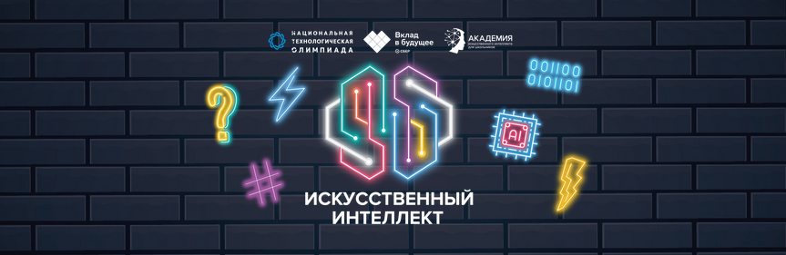

# NTO AI Video Classification

## 2 этап профиля “Искусственный интеллект” НТО 2022/23

Распределите видео по заданным классам.

## Описание задачи

В этом сезоне профиля «Искусственный интеллект» НТО вам предстоит поработать с новым форматом данных – видео. В рамках задачи 2 этапа вам нужно разработать алгоритм, который распределит короткие видео (<1 минуты) на 9 заданных классов:

1. animal – в видео присутствует одно или несколько животных;
2. car – в видео присутствуют автомобили;
3. cloud – в видео показано небо в облаках (тучах);
4. dance – в видео есть танцующий человек (люди);
5. fire – в видео присутствует пламя (огонь, пламя свечи и т.д.);
6. flower – в видео присутствуют цветы;
7. food – в видео готовят еду, либо просто присутствует еда;
8. sunset – в видео показан закат или рассвет;
9. water – в видео показана поверхность воды

Задачи классификации, к которым относится и эта, являются важнейшим классом задач обучения с учителем (supervised learning). При этом стандартные подходы к классификации изображений могут быть расширены и на видео, которые, по сути, представляют из себя последовательность изображений, распределённых во времени. Задача классификации коротких видеофрагментов имеет широкое практическое применение, а успешные модели могут быть использованы, например, для фильтрации видео-контента или тематической классификации видео, а также в задаче поиска (information retrieval).

## Формат решений

В проверяющую систему необходимо отправить код алгоритма, запакованный в ZIP-архив. Решения запускаются в изолированном окружении при помощи Docker. Время и ресурсы во время тестирования ограничены:

- 5Gb на архив с решением
- 25 минут на работу решения

Так как решение не имеет доступ к интернету, все дополнительные данные, например, веса обученной модели, должны быть подгружены в контейнер. В качестве примеры организаторы предоставляют контейнер для запуска бейзлайн-решения.

Доступные ресурсы:

- 8 ядер CPU
- 48Gb RAM
- Видеокарта NVidia Tesla V100

## Метрика

Для оценки решений участников будет использована метрика accuracy, которая показывает долю верно классифицированных объектов выборки.

Метрика accuracy является стандартной метрикой для задач классификации. Она характеризует долю точных совпадений среди пар предсказанных и истинных ответов, то есть отражает отношение числа совпавших ответов (когда модель участника предсказала такой же ответ, как истинный) к общему числу ответов (независимо от того, в определении какого именно класса модель допустила ошибку). Эта метрика изменяется от 0 до 1, где 0 – наихудшее значение, 1 – наилучшее.

$$
accuracy = \frac{\text{True answers}}{\text{All answers}}
$$

## Baseline

Вам доступно базовое решение от разработчиков задачи с использованием фреймворка PyTorch.

Предполагаемый пайплайн работы модели включает в себя следующие этапы:

- вычисление для input видео соответствующих им векторных представлений (эмбеддинги);
- предсказание для каждого из получившихся эмбеддингов метки (лэйбла) одного из классов
